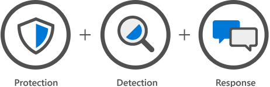

    

    

    
Sikkerhetsløsninger for din virksomhet
    

    

        <a href="../contact">Vis meg en demo!</a>
    
    
    

    

    

Med Microsofts protefølje av sikkerhetsprodukter kan vi sikre dine data mot tap og utilsiktet innsyn. Like viktig er god opplæring av dine medarbeidere, slik at de gjør de riktige tingene for å ivareta sikkerheten. Microsofts skytjenester har et meget høyt sikkerhetsnivå og kan tilpasses dine behov.

Datasikkerhet er en viktig del av GDPR. Vi kan hjelpe deg med å tilfredstille kravene som settes i det nye direktivet.

    

    

    

    

        

            

                        
            

            

                
Beskytte

                    Sikerhet må være en del av planlegging av infrastruktur og i utvikling av programvare. Alle endringer senere må også ha sikkerhet som ett av sjekkpunktene. Microsofts programvare gir  mulighet for å tildele privilegier ved behov slik at man ikke har mer rettigheter enn man til envher tid trenger.
                    Vet du hvem som har tilgang til dataene dine, og hvordan verisfiserer du at det er riktig person? Microsofts løsninger gjør identifisering av bruker og tilgangsstyring smidig både for brukeren og administratorer.       
            
     
        

        

        
Oppdage
        
        Med de riktige verktøyene vil du til enhver tid få oversikt over forsøk på svindel, intrengning og distribusjon av skadelig programvare. I tillegg kan man teste egen sikkerhet for å avdekke mulige svakheter. Man kan også oppdage unormal aktivitet fra egne ansatte og korrigere avvik.
        Hva gjør du ved avvik eller brudd på sikkerheten. Her er det viktig med gode vektøy og rutiner. Isolere hendelsen, sikre egne data og gjennopprette normaltilstand så raskt som mulig.
         
             
        
Respondere
        
        Hva gjør du ved avvik eller brudd på sikkerheten. Her er det viktig med gode vektøy og rutiner. Isolere hendelsen, sikre egne data og gjennopprette normaltilstand så raskt som mulig. 
    
            

        <a href="../contact">Vis meg en demo!</a>
    
  
    
 
    

                

