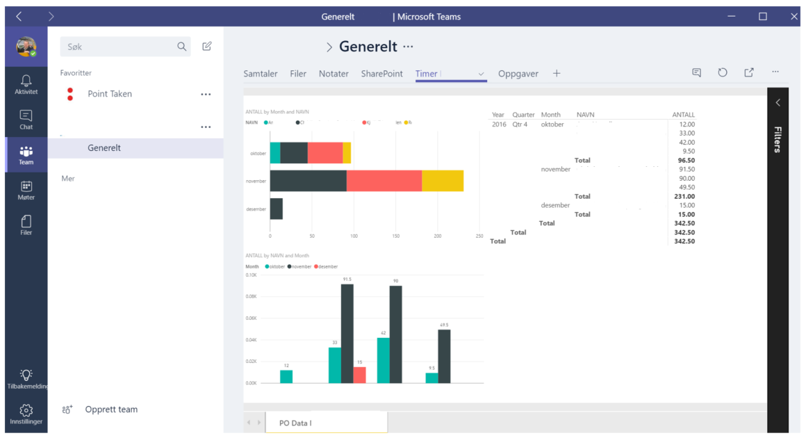
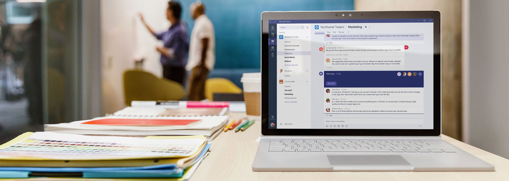
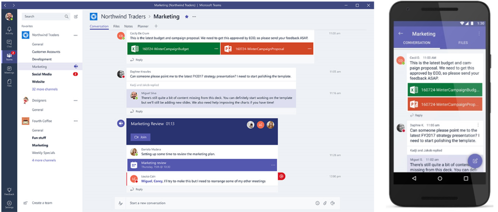

    

    

    

    Microsoft Teams - vær en lagspiller
    

    

        <a href="../contact">Vis meg en demo!</a>
    
    
    

    

    

Dette verktøyet samler ansatte, samtaler, innhold og verktøy på en unik måte. Workplace by Facebook, Slack og Yammer har god samhandlingsfunksjonalitet hver på sin måte, men ingen av dem gjør alt det Teams gjør. 

Teams gir brukerne en mulighet til å samle «alt» på en flate, noe som oppleves som en betydelig forenkling i et virvar av tjenester og apper.
Microsoft teams er en chatbasert arbeidsflate som gir nye samhandlingsmuligheter. Verktøyet er intuitivt med tilgang på avansert funksjonalitet. Microsoft Teams bygger på Microsoft Office 365 som er en skalerbar plattform som er tilgjengelig overalt hvor medarbeideren befinner seg på alle enheter, enten det er smarttelefon, nettbrett eller PC. Klienten er tilgjengelig i IOS, Android og Windows. I tillegg støttes de viktigste nettlesere.

    

    

    

    

        

            

                        
            

            

                
Hva får du egentlig med i boksen?

                <ul>
                <li><i class="fa fa-laptop" aria-hidden="true"></i>Du får med en datamaskin!</li>
                <li><i class="fa fa-area-chart" aria-hidden="true"></i>Du får med noen grafer!</li>
                <li><i class="fa fa-bar-chart" aria-hidden="true"></i>Du får med noen andre grafer også!</li>    
                <li><i class="fa fa-credit-card" aria-hidden="true"></i>Men gullkortet får du aldri!</li>        
                </ul>
            

        

    
 
    

        

         
            
Samtaler for grupper (chat)

            

            Microsoft Teams gir samtaler med historikk som sørger for at alle er engasjert og informert. Gruppesamtaler er synlig for hele gruppen men gir også mulighet for private samtaler. Et rikt bibliotek av emojis og GIF’er, gir brukeren en personlig måte å uttrykke seg på. Teams støtter skrift, lyd og video. I samtalene kan også hente oppdateringer fra andre systemer. Vi har testet med oppdateringer fra Microsoft CRM og Trello. Teams kommer med et rikt bibliotek av slike koblinger, der også Webhooks er støttet. Det gir mulighet til å knytte seg til nær sagt hva som helst av kilder.
            

            
En sentral for samhandling

            
Microsoft Teams samler verktøy fra Office 365 på en enkel og lettfattelig måte. Man kan starte lyd- og videomøter og jobbe med Office-dokumenter direkte i Microsoft Teams. Teams kan inneholde de verktøy og informasjonskilder virksomheten har behov for.
            

            
Kan tilpasses hver gruppe

            
Hver avdeling eller team er unike. Derfor tilbyr Teams muligheten til å tilpasse opplevelsen til å passe enhver avdeling eller gruppe. Hver gruppe kan ha egne kanaler og faner som kan inneholde for eksempel SharePoint dokumentbibliotek, notatbøker, oppgavekort (Planner) og andre programmer. 
            Man kan også inkludere annen funksjonalitet utenfor Office 365. Her finnes det mulgheter for å knytte inn Dynamics 365 eller andre tjenester.
            Point Takens egne prosjekter er alle satt opp med chat, filområde, notatbok, oppgavekort og tall fra timeføring via PowerBI, samt kundeinformasjon fra CRM i Dynamics 365.
            

                

        <a href="../contact">Ta kontakt</a>
    
            
        

    

    

        

            

                        
            

            

                
Sikkerhet du kan stole på

            

Som en del av Office 365 kan Microsoft Teams tilby skalerbar og avansert sikkerhet.  Data er til enhver tid kryptert. Multifaktor autentisering kan tilbys som standard. I tillegg støtter Microsoft industristandarder innenfor sikkerhet og samsvar.
            

            
En sentral for samhandling

            
Microsoft Teams har blitt et kjært bekjentskap for Point Taken og våre kunder, og det legges stadig ny funksjonalitet til tjenesten.
Det er én av fordelene med verktøy og tjenester levert som en skytjeneste: Alltid oppdatert til siste versjon.
Vi deler gjerne av våre erfaringer til de som vil vite mer om Office 365 og Teams.
            
             
        
                
    

    

        <a href="../contact">Ta kontakt</a>
    
                      

